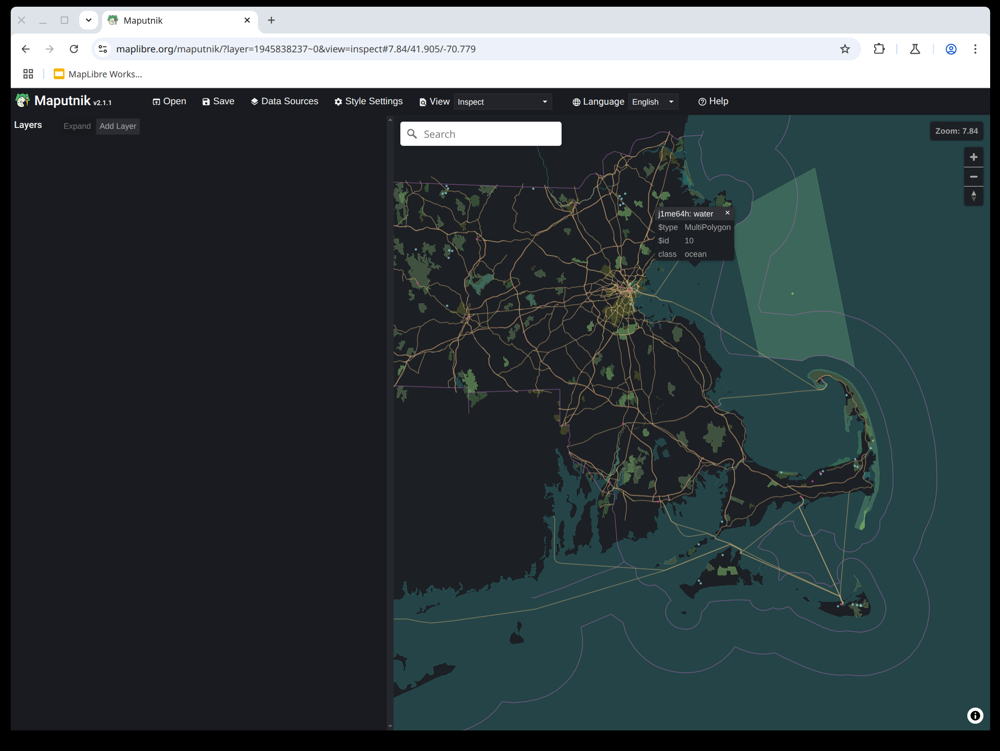

# Make your own base map or overlay tiles with MapLibre stack and Planetiler


Welcome to our workshop organized by [MapLibre](https://maplibre.org/)! We hope you will have fun and learn something useful.

## Your Hosts

- [Yuri Astrakhan](https://github.com/nyurik)
- [Mike Barry](https://github.com/msbarry)
- [Bart Louwers](https://github.com/louwers)

## Goal

1. Create your own vector tiles with [Planetiler](https://github.com/onthegomap/planetiler).
2. Host the vector tiles you created with [Martin](https://martin.maplibre.org/).
3. Learn how create a MapLibre style with [Maputnik](https://github.com/maplibre/maputnik).
4. Intergrate your map on a web page with [MapLibre GL JS](https://github.com/maplibre/maplibre-gl-js).

## Setting up Development Environment

To make best use of the time available for this workshop, we will use [GitHub Codespaces](https://github.com/features/codespaces) to set up the development environment.

Go to the [workshop repository](https://github.com/maplibre/workshop), in the top right click the *Code*, then go to the *Codespaces* tab and click the right button to start a new codespace.


After downloading the Docker image that we prepared for you you will be dropped into a shell. If not, click the small Plus sign above the terminal window to create another shell.

### Quick Start

The workshop now includes a complete Docker Compose setup that provides all the services you need:

1. **Generate tiles** (run once):
   ```bash
   docker compose --profile setup up planetiler
   ```

2. **Start the workshop environment**:
   ```bash
   docker compose up -d
   ```

3. **Import OSM data to PostgreSQL** (optional):
   ```bash
   docker compose --profile import up osm2pgsql
   ```

Once started, you can access:
- 📖 **Main workshop page**: http://localhost:8080
- 🎨 **Maputnik editor**: http://localhost:8080/maputnik/
- 🗺️ **Martin tile server**: http://localhost:8080/tiles/

## 1. Tile Generation

We already downloaded a Boston OSM extract created with [slice.openstreetmap.us](https://slice.openstreetmap.us/).

### Option A: Use Docker Compose (recommended)

```bash
docker compose --profile setup up planetiler
```

This will generate both the base map tiles and bench overlay tiles automatically.

### Option B: Manual tile generation

Run the following command to generate base map tiles:

```bash
java -jar /planetiler.jar --download_dir=/data/sources --minzoom=0 --maxzoom=14 --osm_path=/data/sources/boston.osm.pbf --output=/data/output.mbtiles
```

To generate bench overlay tiles:

```bash
java -jar /planetiler.jar /scripts/benches.yaml --download_dir=/data/sources --minzoom=0 --maxzoom=14 --osm_path=/data/sources/boston.osm.pbf --output=/data/benches.mbtiles
```

#### Expected Result
You should see planetiler generate new files:
- `data/output.mbtiles` (base map)
- `data/benches.mbtiles` (bench overlay)

Use `ls -la data/*.mbtiles` to see them.

## 2. Tile Serving

The MBTiles files that were generated in the previous step can be hosted with a tile server. In this workshop we use Martin, which is included in our Docker Compose setup.

### Option A: Use Docker Compose (recommended)

```bash
docker compose up -d
```

This starts all services including Martin tile server, accessible at http://localhost:8080/tiles/

### Option B: Run Martin manually

```bash
martin data/output.mbtiles data/benches.mbtiles
```

Martin will launch on port 3000. You will get a prompt to expose this port. Expose the port to the internet.

Go to the Ports tab in VS Code to see the public URL for your Martin instance.


Make sure it is set to "Public" you can right-click to change the Visibility.

When you open the URL it shows, you should see the message:

```
Martin server is running.


    The WebUI feature can be enabled with the --webui enable-for-all CLI flag or in the config file, making it available to all users.


    A list of all available sources is at /catalog

See documentation https://github.com/maplibre/martin
```

Go to the catalog, and then to `/output`. This is a TileJSON endpoint which describes the tiles hosted at that path.

## 3. Styling your map

### Using the integrated setup

With the complete workshop environment running, you can access Maputnik directly at http://localhost:8080/maputnik/

The Martin tile server is available at http://localhost:8080/tiles/ for use in Maputnik.

### Manual setup

Go to [Maputnik](https://maplibre.org/maputnik), click open and open the empty style. Next, add a new source. Use the URL of your Martin instance with the `/output` TileJSON endpoint.

Since you don't have any layers, you will not see anything visualized. However, you can switch from the 'Map' view to the 'Inspect' view to see the data contained in your tiles. If it looks something like this, you are doing great so far!



Note that we only have detailed tiles in Massachusetts due to the OSM extract that we used. To generate vector tiles for the entire world would require a more powerful server than the one that GitHub Codespaces offers!

Try adding some layers. Refer to the [MapLibre Style Spec](https://maplibre.org/maplibre-style-spec/) to see what kind of layers you can add. An easy one might be one for the ocean or other water bodies.

Check out what attributes exist in the Inspect view or refer to the documentation of the [OpenMapTiles Schema](https://openmaptiles.org/schema/), which is the tile schema that Planetiler uses by default.

## 4. Creating a Web Page with MapLibre

When you are happy with the style you are created, go to *Save* in the top bar and then *Create HTML*.

Create an index.html in your Codespace and paste the contents of the HTML file that was downloaded. Next, launch a simple web server and expose it to the internet like before.

```
python -m http.server 1234
```

If everything went well, you will have created your own basemap and deployed it in under one hour!

Take a closer look to the generated HMTL to understand how MapLibre GL JS is set up. Explore the [MapLibre GL JS](https://maplibre.org/maplibre-gl-js/docs/) documentation to see what APIs exist. Try for example to add markers to the map when you click somewhere.

## 5. Creating a custom overlay with Planetiler

[`scripts/benches.yaml`](./scripts/benches.yaml) describes how to create [custom map tiles](https://github.com/onthegomap/planetiler/blob/main/planetiler-custommap/README.md) with planetiler containing all of the benches in Boston.  

If you used the automated setup, this was already done for you. Otherwise, run it using the following command:

```bash
java -jar /planetiler.jar scripts/benches.yaml --download_dir=/data/sources --minzoom=0 --maxzoom=14 --osm_path=/data/sources/boston.osm.pbf --output=data/benches.mbtiles
```

Then run martin again to serve those tiles:

```bash
martin data/output.mbtiles data/benches.mbtiles
```

And you can add the source to Maputnik using `https://{public URL for your Martin instance}/benches`

## 6. Working with PostgreSQL and PostGIS

The workshop includes a PostgreSQL database with PostGIS extension for storing and serving vector data.

### Import OSM data to PostgreSQL

Run the following command to import bicycle parking data:

```bash
docker compose --profile import up osm2pgsql
```

This imports bicycle parking locations from the Boston OSM extract into PostgreSQL using osm2pgsql.

### Verify the import

Check the imported data:

```bash
docker compose exec db psql -U postgres -d estonia -c "SELECT COUNT(*) FROM bicycle_parking;"
```

### Access the database

The PostgreSQL database is available at `localhost:5432` with:
- Database: `estonia`
- User: `postgres` 
- Password: `password`

Martin is configured to serve this data as vector tiles at the `/bicycle_parking` endpoint.

### Manual OSM import

The import command above runs automatically with the correct profile:

```bash
docker compose --profile import up osm2pgsql
```

The import script ([`scripts/bicycle_parking.lua`](./scripts/bicycle_parking.lua)) defines how OSM bicycle parking amenities are processed and stored in PostgreSQL.
