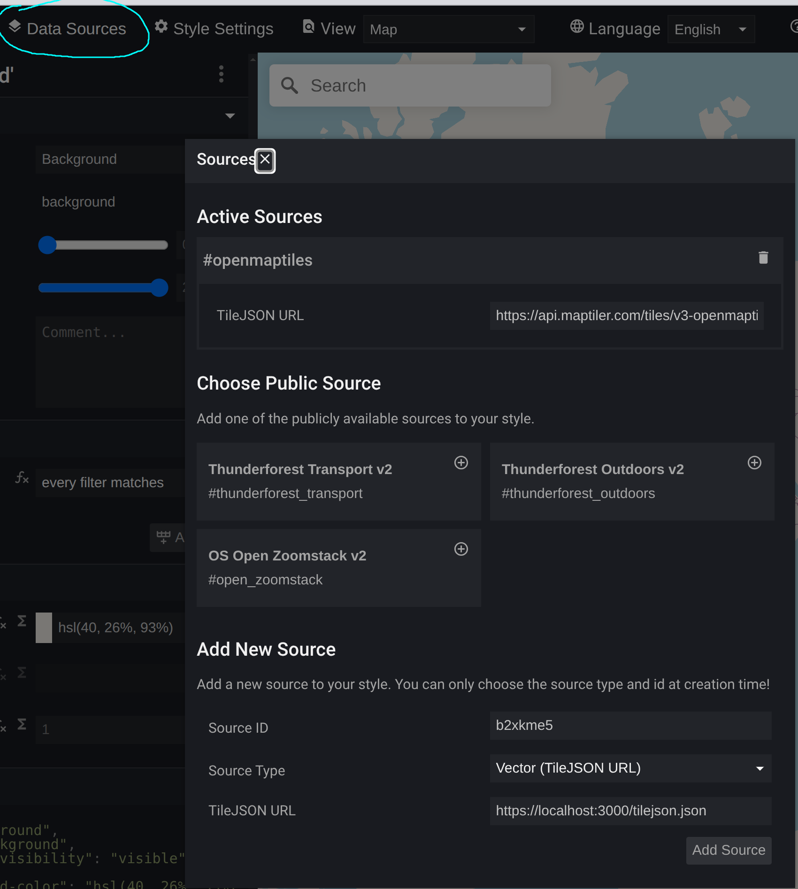

# Make your own base map or overlay tiles with MapLibre stack and Planetiler


Welcome to our workshop organized by [MapLibre](https://maplibre.org/)! We hope you will have fun and learn something useful.

## Your Hosts

- [Yuri Astrakhan](https://github.com/nyurik)

## Goal

1. Create your own vector tiles with [Planetiler](https://github.com/onthegomap/planetiler).
2. Host the vector tiles you created with [Martin](https://martin.maplibre.org/).
3. Learn how to create a MapLibre style with [Maputnik](https://github.com/maplibre/maputnik).
4. Integrate your map on a web page with [MapLibre GL JS](https://github.com/maplibre/maplibre-gl-js).

## Setting up Development Environment

To make the best use of the time available for this workshop, we will use [GitHub Codespaces](https://github.com/features/codespaces) to set up the development environment.

Go to the [workshop repository](https://github.com/maplibre/workshop), in the top right click the *Code*, then go to the *Codespaces* tab and click the right button to start a new codespace.


After downloading the Docker image that we prepared for you you will be dropped into a shell. If not, click the small Plus sign above the terminal window to create another shell.

## 1. Tile Generation

We have already downloaded a DC OSM extract created with [slice.openstreetmap.us](https://slice.openstreetmap.us/).

Run the following command.

```
java -jar /planetiler.jar --download_dir=/data/sources --minzoom=0 --maxzoom=14 --osm_path=/data/sources/dc.osm.pbf --output=/data/dc.mbtiles
```

#### Expected Result
You should see planetiler generate a new file `/data/dc.mbtiles`.  Use `ll /data/dc.mbtiles` to see it.

## 2. Tile Serving

The MBTiles file generated in the previous step can be hosted with a tile server. In this workshop we will use Martin, which is pre-installed to the development container.

Run the following command:

```
martin   --webui enable-for-all   /data/dc.mbtiles
```

Martin will launch on port 3000. You will get a prompt to expose this port. Expose the port to the internet.

Go to the Ports tab in VS Code to see the public URL for your Martin instance.


Make sure it is set to "Public" you can right-click to change the Visibility.

When you open the URL it shows, you should see the message:

```
Martin server is running.


    The WebUI feature can be enabled with the --webui enable-for-all CLI flag or in the config file, making it available to all users.


    A list of all available sources is at /catalog

See documentation https://github.com/maplibre/martin
```

Examine the catalog endpoint by appending `/catalog` to the URL. See that `dc` source is available.

Also, examine the `/dc` URL. This is a TileJSON endpoint that describes the tiles hosted at that path.  Note this URL - you will need it in the next step.

## 3. Styling your map

* Go to [Maputnik](https://maplibre.org/maputnik)
* click open and open the `OSM OpenMapTiles` style
* Use the data source editor to **modify** the existing active source `#openmaptiles`. Use the URL of your Martin instance with the `/dc` TileJSON endpoint from the previous step.



* Click the `x` button next to the `Sources` to close the data source editor.

* Note that we only have detailed tiles for a small area due to the OSM extract that we used. Try to zoom out, and re-zoom in on DC to see details. To generate vector tiles for the entire world would require a somewhat more powerful server than the one that GitHub Codespaces offers.

* You can switch from the 'Map' view to the 'Inspect' view to see the data contained in your tiles. If it looks something like this, you are doing great so far!


* Try adding some layers. Refer to the [MapLibre Style Spec](https://maplibre.org/maplibre-style-spec/) to see what kind of layers you can add. An easy one might be one for the ocean or other water bodies.

* Check out what attributes exist in the Inspect view or refer to the documentation of the [OpenMapTiles Schema](https://openmaptiles.org/schema/), which is the tile schema that Planetiler uses by default.

## 4. Creating a Web Page with MapLibre

When you are happy with the style you are created, go to *Save* in the top bar and then *Create HTML*.

Create an index.html in your Codespace and paste the contents of the HTML file that was downloaded. Next, launch a simple web server and expose it to the internet like before.

```
python -m http.server 1234
```

If everything went well, you will have created your own basemap and deployed it in under one hour!

Take a closer look to the generated HMTL to understand how MapLibre GL JS is set up. Explore the [MapLibre GL JS](https://maplibre.org/maplibre-gl-js/docs/) documentation to see what APIs exist. Try for example to add markers to the map when you click somewhere.

## 5. Creating a custom overlay with Planetiler

[`scripts/benches.yaml`](./scripts/benches.yaml) describes how to create [custom map tiles](https://github.com/onthegomap/planetiler/blob/main/planetiler-custommap/README.md) with planetiler containing all of the benches in DC.  Run it using the following command:

```
java -jar /planetiler.jar scripts/benches.yaml --download_dir=/data/sources --minzoom=0 --maxzoom=14 --osm_path=/data/sources/dc.osm.pbf --output=/data/benches.mbtiles
```

Then run martin again to serve those tiles:

```
martin   --webui enable-for-all   /data/dc.mbtiles /data/benches.mbtiles
```

In maputnik, add the new source using `https://{public URL for your Martin instance}/benches` - lets call it `benches`. You can then add a new layer to the map using the `benches` source. For example, you can add a circle layer that shows benches in DC.


## Connect to the Database

Test the connection to the PostgreSQL database that is running in the container. You can use the following command to connect to the database. Use `quit` or Ctrl-D to exit the psql shell.

```sh
psql postgres://postgres:password@db/maplibre

osm2pgsql -d postgresql://postgres:password@db/maplibre -O flex -S scripts/bicycle_parking.lua /data/sources/dc.osm.pbf

martin   --webui enable-for-all   /data/dc.mbtiles postgres://postgres:password@db/maplibre
```
